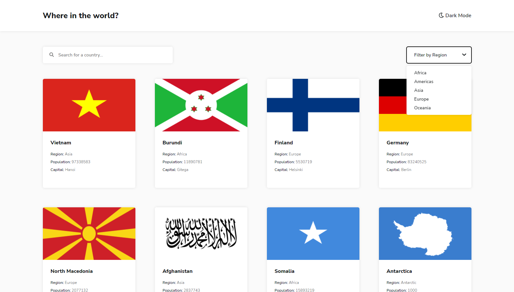
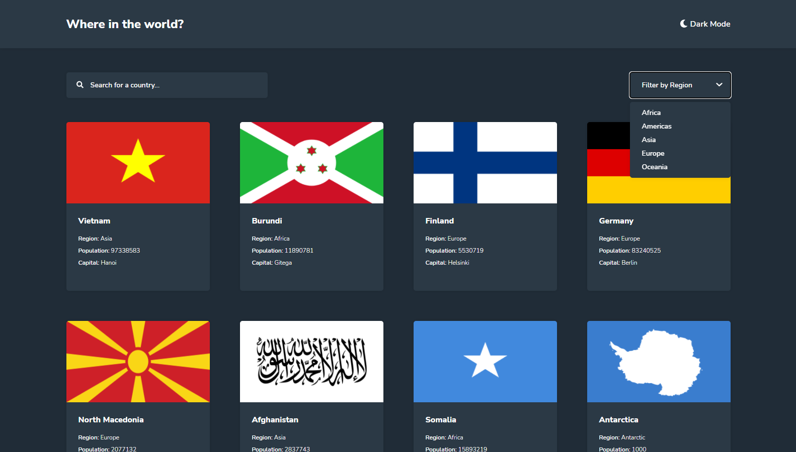
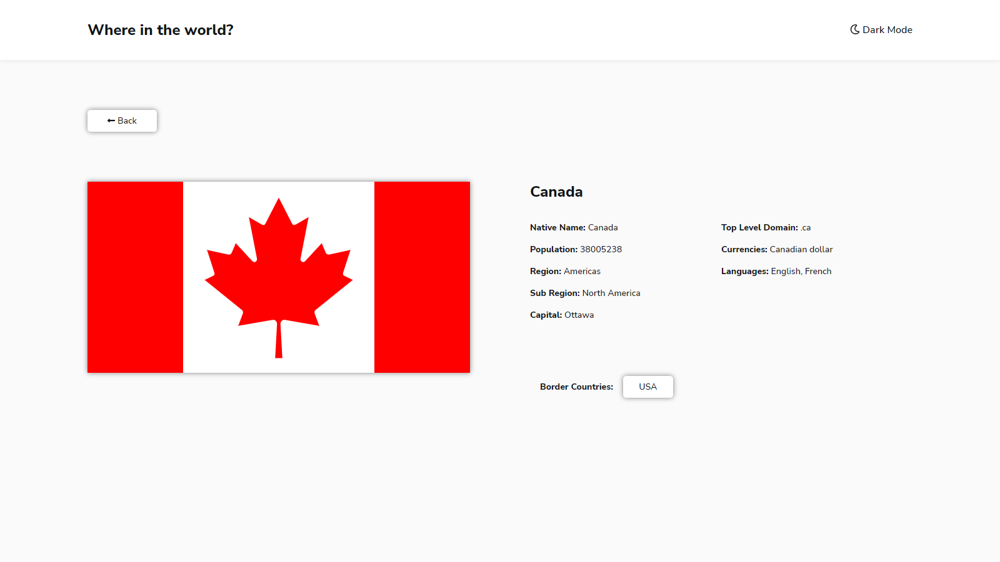

# Frontend Mentor - REST Countries API with color theme switcher solution

This is a solution to the [REST Countries API with color theme switcher challenge on Frontend Mentor](https://www.frontendmentor.io/challenges/rest-countries-api-with-color-theme-switcher-5cacc469fec04111f7b848ca). Frontend Mentor challenges help you improve your coding skills by building realistic projects. 

## Table of contents

- [Overview](#overview)
  - [The challenge](#the-challenge)
  - [Screenshot](#screenshot)
  - [Links](#links)
- [My process](#my-process)
  - [Built with](#built-with)
  - [What I learned](#what-i-learned)
  - [Continued development](#continued-development)
  - [Useful resources](#useful-resources)
- [Author](#author)

## Overview

### The challenge

Users should be able to:

- See all countries from the API on the homepage
- Search for a country using an `input` field
- Filter countries by region
- Click on a country to see more detailed information on a separate page
- Click through to the border countries on the detail page
- Toggle the color scheme between light and dark mode *(optional)*

### Screenshot

### Links

- Solution URL: [https://www.frontendmentor.io/solutions/rest-countries-api-using-typescript-react-xOCTgTKzw](https://www.frontendmentor.io/solutions/rest-countries-api-using-typescript-react-xOCTgTKzw)
- Live Site URL: [https://blairs-rest-countries-challenge.netlify.app/](https://blairs-rest-countries-challenge.netlify.app/)

## My process

### Built with

- Semantic HTML5 markup
- CSS custom properties
- Flexbox
- CSS Grid
- [TypeScript](https://www.typescriptlang.org/) - Language
- [React](https://reactjs.org/) - JS library
- [Styled Components](https://styled-components.com/) - For styles

### What I learned

This was my first time using TypeScript so I learnt alot about declaring value types. I had trouble at first declaring react components types and other TypeScript declarations.
I reinforced my knowledge of React and Styled Components and have tried different ways of using them compared to my past projects.

### Continued development

As this was my first time using TypeScript there are still alot of things about TypeScript I haven't completely mastered.
Some things I'd like to improve in the future are:
- Declarations
- Interfaces
- Types
- Best Practices

### Useful resources

- [MDN Web Docs](https://developer.mozilla.org/en-US/) - This helped me with everything. HTML, CSS, JavaScript, this is a great resource for every developer.
- [W3Schools](https://www.w3schools.com/) - Great resource for seeing examples.
- [TypeScript](https://www.typescriptlang.org/) - Language
- [React](https://reactjs.org/) - JS library
- [Styled Components](https://styled-components.com/) - For styles

## Author

- Website - [BlairB.Dev](https://blairb.dev)
- Frontend Mentor - [@BB2455](https://www.frontendmentor.io/profile/BB2455)
